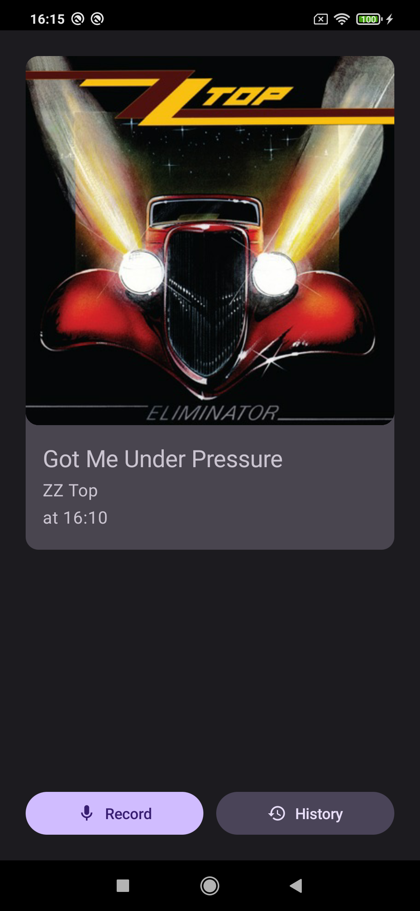
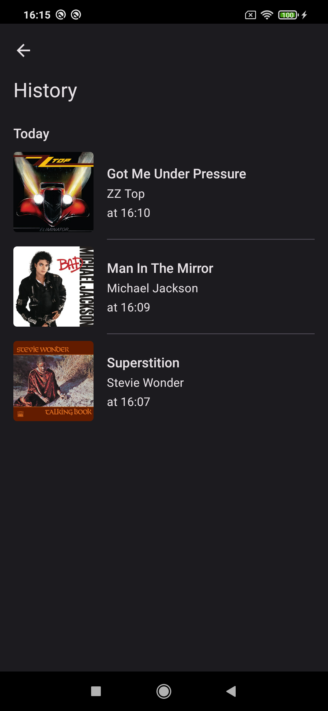
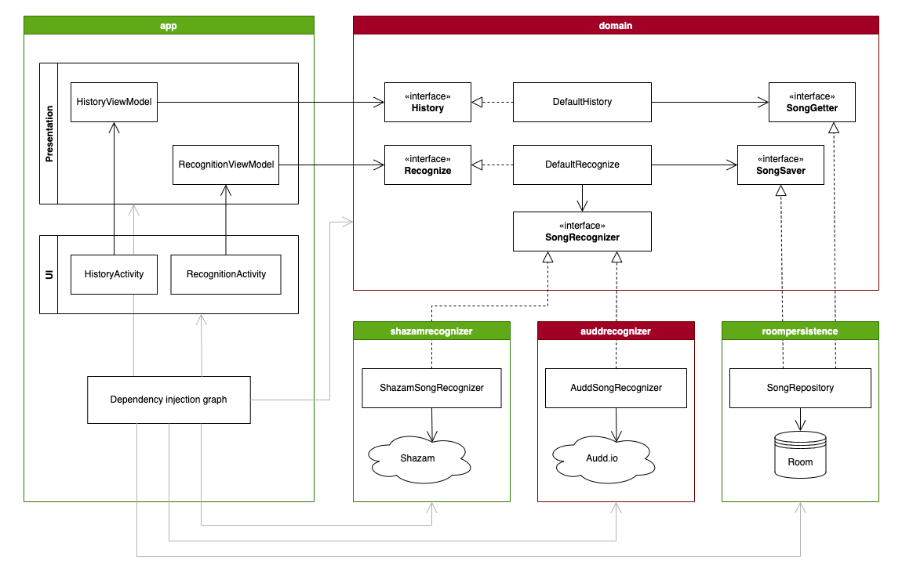

# Horton
Music recognition app for Android.

## Description
Horton recognizes songs playing in your surroundings (e.g. coffee shop, bar, club, car) and saves them to local storage for easy access later. It only communicates with services required for song recognition. 

## Screenshots and features
 

Most notable features: 
- Recognize songs from your surroundings
- Save recognized songs to **local** history
- Organize recognized songs by time and date
- Portrait and landscape
- Dark and light theme
- Dynamic theme for Android 12 and up (based on device wallpaper color)

## Song recognition services
Currently, the supported recognition services are: 
- [Audd.io](https://audd.io/) for which you need to supply your own API key. They require sending the audio file to their backend in full. 
- Shazam for which you need to supply your own way of communicating with their backend. This project implements the fingerprint generator from [SongRec](https://github.com/marin-m/SongRec), but not the backend communication.

The project's architecture is set up in a way that allows for easy addition and removal of song recognition services so that other services can be added later without disturbing the UI and independent parts of the codebase.

You can provide additional song recognition services by writing a `*recognizer` module. The only thing this module requires is that you extend the `SongRecognizer` interface and provide your implementation. Refer to the *auddrecognizer* module as an example. 

## Project architecture
This project draws heavy inspiration from Uncle Bob's clean architecture. It aims to separate business rules from implementation details such as network access, database operations and the user interface towards easier development and maintenance. 

The project is split into multiple Gradle modules: 

- **domain** Kotlin library that defines the app's purpose (business rules). As the diagram shows, the app recognizes songs and saves them to some form of history for later access. This module embodies the domain and entities layers of Uncle Bob's clean architecture. Originally, there was a separate *entities* module, but it only contained a single data class with no business rules of its own, so I removed it to keep things simple. 

- **roompersistence** Android library that implements the `SongSaver` and `SongGetter` interfaces with local Android storage using Room. This allows business rules to be independent of the actual persistence mechanism. This could just as easily have been implemented with Realm or remote, flat-file or in-memory storage. 

- **auddrecognizer** Kotlin library that implements the `SongRecognizer` interface using Audd.io. This allows business rules to be independent of the actual recognition mechanism. In other words, Audd recognition can be easily replaced with any other mechanism, as illustrated in the next point. 

- **shazamrecognizer** Android library that ports the fingerprint generation algorithm written in Rust from [SongRec](https://github.com/marin-m/SongRec). The implementation of `SongRecognizer` is not provided here, you would need to write it yourself and connect to Shazam's backend. 

- **app** Android app module that uses the `Recognition` and `History` use cases to recognize and display previously recognized songs. Other modules have no idea that there is a UI at all, let alone that it is implemented with Jetpack Compose or Android architecture components. It can be replaced with any other UI toolkit, and with minimal effort. 

    This module also manages dependency injection with Dagger Hilt and it is the only module that does so. This makes it very easy to later switch out the dependency injection framework for Koin or plain Dagger. 

## Buzzwords
The project uses the following Android mechanisms and libraries: 
- Jetpack Compose
- Model-View-ViewModel
- Kotlin Coroutines
- Dagger Hilt
- Material Design 3
- Retrofit, OkHttp, Gson
- Room Database
- Clean Architecture
- Rust cross-compilation for Android (in [horton-shazam-recognizer](https://github.com/davidtakac/horton-shazam-recognizer))

## Similar projects
- [SongRec, open-source Shazam client for Linux](https://github.com/marin-m/SongRec) by marin-m. 